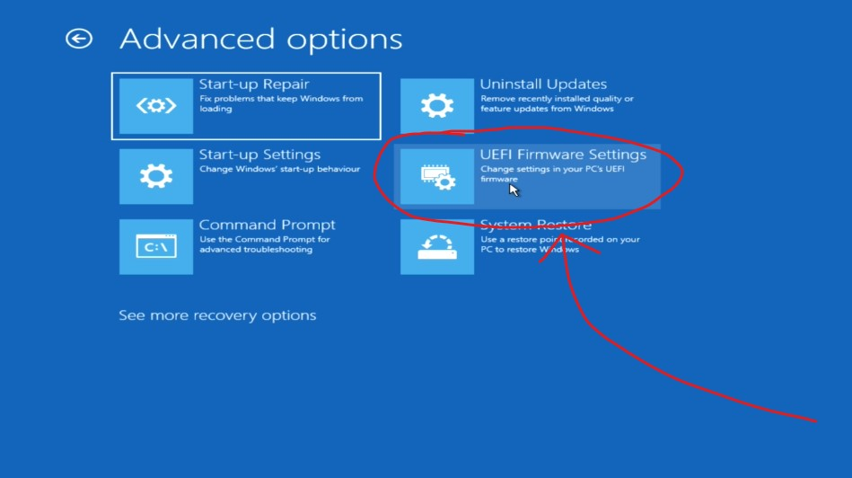

# Home computing at CSE using WSL2 🏠💻

### Firstly, huge shoutout to William Huynh, who wrote a [fantastic guide for WSL2](https://github.com/WilliamHuynh5/unsw-cse-home-computing-wsl2), which this guide adds on to. 🤩

Welcome to the official CSESoc Edu guide on setting up a local development environment using WSL2!

This guide is also available as a video 📷, which you may find easier to follow.

By following this guide you will learn how to create and work seamlessly on a Linux environment using your Windows computer, without having to deal with the hassle that is VLAB and SSH.

> Fair warning, if you are currently a **COMP1511** student, and you aren't too familiar with Linux or developing locally, it is strongly recommended that you continue to use `VLAB` or `VSCode SSH FS` for at least the first few weeks, until you feel comfortable, before seeking out a more advanced method for developing locally.

## What's the point? 🤔

During your time at UNSW you have probably used **TigerVNC**, **SSH** or even **SSH FS** to connect to UNSW's CSE machines while at home.

While using any of these methods does work, they're not exactly the best experience. **TigerVNC** for example can require quite a bit of internet bandwidth, making it unreliable if your internet is unstable. Similarly **SSH** can often lag between commands, making the experience frustrating at the best of times.

While VSCode's **SSH FS** extension does address most of these issues, some more powerful extensions don't work with SSH FS, which can get frustrating later in your degree.

And perhaps most importantly, all of these methods do not allow you to customise your shell with **zsh** and **oh-my-zsh**.

Fortunately WSL allows you to create a *seamless* local setup, which can even be used without an internet connection.

## So what is this WSL2? ❓

**Windows Subsystem for Linux** (WSL) is a feature of Windows which allows developers to run a Linux environment, without the hassle of a whole virtual machine or dual booting. 

In simple terms, it gives you a Linux terminal on your Windows machine without too much hassle.

# Let's get into it! 😎

## Enabling virtualisation: 🛠️

### Checking if Virtualisation is enabled

First off, to make sure your computer can run WSL, you need to check if virtualisation is enabled on your computer, this is quite easy to do.

First you will need to open task manager by right clicking on the windows start button, then clicking **Task Manager**, if you are in simplified mode, click **More details** on the bottom of the window.

Next go to the **Performance** tab in task manager, and look for **Virtualisation**.


If it says Enabled, you can skip to the [next step](#installing-wsl), however if it's disabled, we need to enable it in our computer's BIOS menu.

## Accessing BIOS Menu 🤓

To access our BIOS menu, firstly open settings, then search for **Advanced startup**. Depending on your version of windows the result may be named slightly different, but it should be similar to **Change advanced start-up options**. Click on that and then click on **Restart now** next to **Advanced startup**.


Once your computer has restarted, you will be met with a menu, first click on troubleshoot.


Then Advanced options


Then click on UEFI Firmware Settings



Your computer will now restart again, and will load into your computer's BIOS menu. This is where explaining how to enable virtualisation gets tricky, as every different motherboard manufacturer uses a different BIOS menu, and a lot of the time, the same manufacturer will also use different BIOS menus. So in general, you will be looking for Advanced settings > CPU settings > Virtualisation.

On my BIOS the process is like this

First enter Advanced Mode either by clicking the button or pressing F7


Find your CPU settings, mine were in the Advanced tab, in CPU Configuration.


Then find the option for virtualisation, mine is Intel Virtualization technology as I have an intel cpu, but this could also be called AMD Virtualization, Intel VT-x, AMD-V, SVM, Vanderpool, Intel VT-d or AMD IOMMU.


Finally exit out of your BIOS, make sure you chose whatever option saves your changes.


That is thankfully the most complicated step of installing WSL, and from here on out everything is smooth sailing.

## Installing WSL 🎉

1. Open **Start** on Windows
2. Search for **Command Prompt**
3. Right-click on the top result, and select **Run as administrator** from the menu
4. Type the following command and press **Enter**

```
wsl --install
```
5. Wait for it to finish installing, you will now need to restart your computer.
6. Once your computer has rebooted, a terminal will appear which will say it is installing ubuntu, this will take a few minutes, and then ubuntu will launch.

> If your installation was unsuccessful for any reason, try it again from the first step

## Post Installation 🙌

You can launch your **WSL2** installation by opening **Start** on Windows and searching for **Ubuntu**.

> **Ubuntu** is the default linux distribution installed by WSL2. It is very beginner friendly to use and has a lot of documentation + support online. You can check out the documentation [here](https://learn.microsoft.com/en-us/windows/wsl/)!

> **Important!** When you launch WSL2 for the first time, you will be prompted to enter a password. But the password characters are invisible! This is known as blind typing. If you accidentally typed something and don't remember what it was, just hold the backspace key for a good five seconds 😅. Then carefully type in your password again, and press Enter!

Once you've launched it and configured a password, you should be greeted with something similar to this.


# Configuring WSL2 🔧

Now that you have successfully installed WSL2 there are just a few more steps we will take to ensure our WSL setup is ready for you to start programming.

First off, we need to update our version of Ubuntu, to make sure we have the most up to date packages, this is great for maintaining your Ubuntu image and keeping it secure.

In WSL, you will need to type the following command and press **Enter**.
```
sudo apt update && sudo apt upgrade
```
> You will be prompted to enter in your `sudo password`. Enter in the password you created before

> **Ubuntu** will **not** update itself automatically, so it is recommended you do this step semi-frequently!

## Installing VSCode and the WSL extension 💻

The recommended IDE here at UNSW is Microsoft's Visual Studio Code (VSCode), thanks to its reliability, efficiency and large range of extensions.

Firstly, back on **Windows**, visit the [VSCode install page](https://code.visualstudio.com/download) and download & run the installer.

Once the installer has finished, open up VSCode, if you did not create a shortcut during the install, you can open VSCode by pressing **Start** and searching for **Visual Studio Code**.

Once VSCode has opened, you will need to download the WSL extension, to do this, click on the extensions tab on the left, then search for **Remote Development** and click install on the first result, which should have more than 3 million downloads.


And that's all, to test it out, simply reopen Ubuntu, and in the terminal, enter this command:

```
code .
```

The first time you run the command Ubuntu will install a VSCode server, however whenever you open it again, VSCode will open almost immediately.


> To open a specific file in VSCode, you can run: `code myfile.txt`

> To open your current working directory in VSCode, you can run: `code .`

## Installing recommended languages 📖
Here we will learn to install some languages and tools that are used in a majority of CSE courses.

### C - **gcc**, **gdb** & **valgrind** ⚔️
> (COMP1511, COMP1521, COMP2521)

1. Install **gcc**, **gdb** and **valgrind**
```
sudo apt install gcc gdb valgrind
```
2. Confirm the installation
```
gcc --version
gdb --version
valgrind --version
```
3. While not strictly necessary, I highly recommend installing the C/C++ Language Pack VSCode extension for Intellisense features.
   
## JavaScript & TypeScript - **nodeJS** 🌐
> (COMP1531, COMP6080)

1. Install **CURL** (a tool used for downloading content from the internet in the command-line) 
```
sudo apt-get install curl
```
2. Install **nvm** (*node version manager*)
```
curl -o- https://raw.githubusercontent.com/nvm-sh/nvm/master/install.sh | bash
```
3. Once you have curled **nvm** you will need to restart your bash shell, you can do this by entering the following command and pressing **Enter**
   
```
exec bash
```

4. Confirm the installation of **nvm**. It should output `"nvm"` in the terminal. If you received `command not found`, start again from **Step 1**.
```
command -v nvm
```
5. Install **nodeJS**
```
nvm install --lts
nvm install node
```
6. Confirm the installation of **nodeJS**
```
node --version
npm --version
```

## Java - **jdk** ☕
>Used in **COMP2511**
1. Install **jdk**
```
sudo apt install openjdk-11-jdk
```
2. Confirm the installation of **jdk**
```
java --version
```
3. Install the Extension Pack for Java VSCode extension pack.
   
## Python - **python3** & **pip** 🐍
> (COMP1010, COMP2041, COMP3311 & everywhere in real life)

1. Install **python3** & **pip3**
```
sudo apt install python3 python3-pip
```
2. Confirm the installation of **python3** and **pip3**
```
python3 --version
pip -V
```
3. As you may have guessed, Install the Python Language Pack VSCode extension.

# End 🥳

Congratulations, you've made it to the end of this WSL Guide, but there is more you can do! 

Right now your Ubuntu terminal looks pretty boring, so I recommend heading over to our "Spicing up your shell using ZSH ✨" guide, written by the one and only William Huynh, so you can level up your setup from lame boring bash, to cool and epic zsh.

Additionally, how can we make this WSL installation communicate with our CSE computer for us? You can find out all about that in the [SSH FS mounting guide](https://abiram.me/cse-sshfs) by Abiram. While it shares the same name as the VSCode extension, SSH FS mounting is a more advanced method, which fixes VSCode's issue where more powerful extensions won't work when using VSCode SSH FS.

Thanks for reading this guide, I hope it was useful. If you find or experience any errors, or just have any recommendations, please email me at <a href="mailto:liam.smith@csesoc.org.au">liam.smith@csesoc.org.au</a>.

